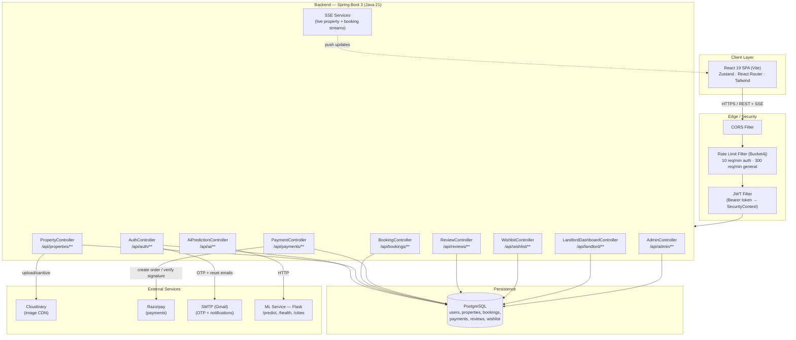
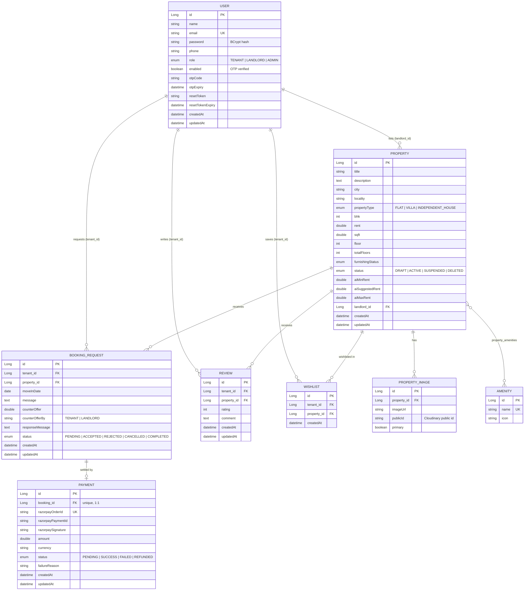

# RentEase — Online Property Rental Platform

RentEase is a full-stack property rental platform that connects **landlords** and **tenants** through a secure, role-based marketplace. It combines a Spring Boot REST API, a React SPA, and a Python microservice that uses machine learning to predict fair rent prices — all wired together with JWT authentication, real-time updates, and integrated payments.

<p align="left">
  
  
  
  
  
  
</p>

---

## 📑 Table of Contents

- [Overview](#-overview)
- [Key Features](#-key-features)
- [Tech Stack](#-tech-stack)
- [System Architecture](#-system-architecture)
- [Database Design (ER Diagram)](#-database-design-er-diagram)
- [API Overview](#-api-overview)
- [Security](#-security)
- [ML Rent Prediction Service](#-ml-rent-prediction-service)
- [Project Structure](#-project-structure)
- [Getting Started](#-getting-started)
- [Environment Variables](#-environment-variables)
- [Roadmap](#-roadmap)
- [Contributing](#-contributing)

---

## 📖 Overview

RentEase digitizes the end-to-end rental journey:

- **Landlords** list properties, get AI-suggested rent ranges, manage incoming booking requests, negotiate rent, and track a dashboard of their listings.
- **Tenants** search and filter listings, wishlist properties, request bookings with move-in dates, negotiate rent via counter-offers, pay securely via Razorpay, and leave reviews.
- **Admins** moderate the platform — suspend properties, disable abusive accounts, and remove inappropriate reviews.

The system is split into three independently deployable services: a **Java/Spring Boot backend**, a **React frontend**, and a **Python/Flask ML microservice** for rent prediction.

---

## Key Features

| Category | Highlights |
|---|---|
| **Authentication** | Email/password signup with OTP email verification, JWT-based stateless sessions, forgot/reset password flow |
| **Role-based access** | Three roles — `TENANT`, `LANDLORD`, `ADMIN` — each with dedicated dashboards and route guards on both frontend and backend |
| **Property listings** | Create/edit/delete listings with multiple images, amenities, furnishing status, BHK, floor, and area; primary image selection |
| **AI rent prediction** | ML-backed suggested rent range (min / suggested / max) shown to landlords while listing a property |
| **Search & discovery** | Filterable, paginated property search (city, locality, type, BHK, budget) with live/streaming updates |
| **Booking workflow** | Booking requests with move-in date and message, accept/reject/cancel, and **rent negotiation** via counter-offers from either party |
| **Payments** | Razorpay integration for first month's rent + 2 months' security deposit, with signature verification |
| **Reviews & ratings** | One review per tenant per property (unique constraint), editable/deletable |
| **Wishlist** | Tenants can save/unsave properties for later |
| **Real-time updates** | Server-Sent Events (SSE) streams for live property listings and booking status changes |
| **Landlord dashboard** | Aggregated stats — active listings, pending requests, revenue, etc. |
| **Admin console** | Platform-wide stats, user search & suspension, property suspension, review moderation |
| **Image security** | Uploaded images are MIME-sniffed, size/dimension-capped, and re-encoded to strip EXIF/metadata before hitting Cloudinary |

---

## Tech Stack

### Backend — `backend/`
| Layer | Technology |
|---|---|
| Language / Runtime | Java 21 |
| Framework | Spring Boot 3.5.14 (Web, Data JPA, Security, Validation, Actuator, Mail) |
| Database | PostgreSQL |
| Auth | JJWT (JSON Web Tokens) 0.12.6 + BCrypt password hashing |
| Rate limiting | Bucket4j (token-bucket, per-IP) |
| File storage | Cloudinary (image hosting/CDN) |
| Payments | Razorpay Java SDK |
| Image validation | Apache Tika (MIME sniffing), `metadata-extractor` (EXIF handling) |
| Build tool | Maven (`mvnw`) |
| Boilerplate reduction | Lombok |

### Frontend — `frontend/`
| Layer | Technology |
|---|---|
| Framework | React 19 + Vite 8 |
| Routing | React Router v7 |
| State management | Zustand |
| Styling | Tailwind CSS 3 |
| Forms & validation | React Hook Form + Zod |
| HTTP client | Axios |
| Animation | Framer Motion |
| 3D / visuals | Three.js (hero canvas) |
| Charts | Recharts (dashboards) |
| UX utilities | `react-hot-toast`, `react-dropzone`, `react-day-picker`, `browser-image-compression` |
| Testing | Vitest + Testing Library |
| Linting | ESLint |

### ML Service — `ml-service/`
| Layer | Technology |
|---|---|
| Framework | Flask 3 + Flask-CORS |
| ML / Data | scikit-learn, pandas, numpy |
| Model persistence | joblib (`rent_model.pkl`, city/locality label encoders) |
| Serving | REST endpoints (`/predict`, `/health`, `/cities`) consumed internally by the Spring Boot backend |

### Docs
| Item | Location |
|---|---|
| Project report / documentation | `docs/RENTEASE.pdf` |

---

## 🏗 System Architecture

RentEase follows a **three-tier, service-oriented architecture**. The React SPA never talks to the ML service directly — all traffic is proxied and orchestrated through the Spring Boot backend, which acts as the single source of truth for auth, business rules, and data persistence.



**Request flow in short:** every inbound request passes through the `RateLimitFilter` (per-IP token bucket) and then the `JwtFilter` (validates the Bearer token, loads the user's role into Spring Security's context) before reaching a controller. Controllers delegate to services, which enforce ownership/business rules and talk to Spring Data JPA repositories backed by PostgreSQL. Long-running/real-time features (new listings, booking status changes) are pushed to clients via **Server-Sent Events** instead of polling. Rent prediction is the only call that leaves the JVM to another internal service (Flask), never called directly by the frontend.

## 🗃 Database Design (ER Diagram)

The schema is managed by Hibernate (`ddl-auto=update`) from the JPA entities in `backend/.../entity/`. Core relationships:



**Notable constraints:**
- `REVIEW (tenant_id, property_id)` and `WISHLIST (tenant_id, property_id)` are **unique composite constraints** — one review and one wishlist entry per tenant per property.
- `PAYMENT.booking_id` is a **one-to-one** relationship — each booking has at most one payment record.
- `PROPERTY ↔ AMENITY` is **many-to-many** via the join table `property_amenities`.
- `PROPERTY.images` cascades `ALL` with `orphanRemoval = true` — deleting a property (or removing an image reference) cleans up child image rows automatically.

## 🔌 API Overview

All endpoints are prefixed with `/api`. Access control is enforced both by `SecurityConfig` (role-based URL rules) and by ownership checks inside each service.

| Resource | Base path | Public? | Notes |
|---|---|---|---|
| Auth | `/api/auth/**` | ✅ Public | register, verify-otp, login, resend-otp, `me`, profile update, change/forgot/reset password |
| Properties | `/api/properties/**` | ✅ Public reads | list, get by id, search, `/stream` (SSE); create/update/delete/image upload require `LANDLORD` ownership |
| Amenities | `/api/amenities/**` | ✅ Public | list amenities, attach to a property |
| Bookings | `/api/bookings/**` | 🔒 Authenticated | create request, tenant/landlord views, status update, counter-offer negotiation, `/stream` (SSE) |
| Payments | `/api/payments/**` | 🔒 Authenticated | create Razorpay order, verify payment signature, fetch payment by booking |
| Reviews | `/api/reviews/**` | ✅ Public reads | create/edit/delete (tenant-owned), public per-property listing |
| Wishlist | `/api/wishlist/**` | 🔒 Authenticated (Tenant) | add/remove/check |
| Landlord dashboard | `/api/landlord/**` | 🔒 `ROLE_LANDLORD` | aggregated stats for the logged-in landlord |
| Admin | `/api/admin/**` | 🔒 `ROLE_ADMIN` | platform stats, user search/suspend, property suspend, review moderation |
| AI prediction | `/api/ai/**` | ✅ Public | proxies to the Flask ML service for a rent estimate |
| Health | `/actuator/health` | ✅ Public | Spring Boot Actuator health check |

> Full request/response contracts live in the DTO classes under `backend/src/main/java/com/rentease/backend/dto/`.

---

## 🔐 Security

Security is layered across the request lifecycle rather than relying on a single mechanism:

1. **Stateless JWT authentication** — `JwtUtil` signs/verifies HMAC-SHA tokens (`io.jsonwebtoken`) carrying the user's email and role, with a configurable expiry (`JWT_EXPIRY_MS`, default 24h). Sessions are `STATELESS` (`SessionCreationPolicy.STATELESS`) — no server-side session state.
2. **Password hashing** — user passwords are stored using `BCryptPasswordEncoder`, never in plaintext.
3. **OTP-gated registration** — new accounts are `enabled = false` until an emailed OTP is verified, preventing throwaway/unverified sign-ups from accessing the platform.
4. **Role-based authorization** — `SecurityConfig` enforces route-level rules (`hasRole("ADMIN")`, `hasRole("LANDLORD")`) on top of `@PreAuthorize`-style checks and manual ownership checks inside services (e.g. a tenant can only pay for *their own* booking; a landlord can only edit *their own* listings).
5. **Rate limiting** — `RateLimitFilter` uses Bucket4j to maintain a **per-IP token bucket**: a strict 10 requests/minute bucket for `/api/auth/**` (to blunt credential stuffing / OTP abuse) and a relaxed 300 requests/minute bucket for general traffic, with SSE streaming endpoints exempted from the limiter.
6. **CORS lockdown** — only explicitly allow-listed origins (local dev by default) can make credentialed cross-origin requests; CSRF protection is disabled in favor of stateless bearer-token auth, which is not vulnerable to classic CSRF.
7. **Upload hardening (`ImageSanitizationService`)** — every uploaded image goes through a sanitization pipeline before it ever reaches Cloudinary:
   - File size cap (10 MB).
   - **True MIME-type detection** via Apache Tika reading file magic bytes (not just trusting the extension/`Content-Type` header), rejecting disguised uploads.
   - Explicit blocklist for dangerous types (`image/svg+xml`, `text/html`, `application/xml`, `application/javascript`) to prevent stored-XSS/XXE via "image" uploads.
   - Dimension caps (max 8000×8000) to guard against decompression / pixel-bomb attacks.
   - Re-encoding to strip EXIF and other embedded metadata before storage.
8. **Payment integrity** — Razorpay order creation and payment verification are done server-side; the payment signature is validated using HMAC-SHA256 against the Razorpay secret before a booking is marked paid, so a client can never fake a successful payment.
9. **Secrets management** — all credentials (DB, JWT secret, mail, Cloudinary, Razorpay) are injected via environment variables / an untracked `application-local.properties`, never committed to source control.
10. **Least-privilege endpoint exposure** — Actuator only exposes the `health` endpoint publicly; everything else requires authentication or an explicit role.

---

## 🤖 ML Rent Prediction Service

`ml-service/` is a small Flask app that serves a pre-trained regression model (`train_model.py` produces `rent_model.pkl` plus label encoders for city/locality) estimating a fair market rent.

- **Input features**: BHK, size (sqft, log-transformed), size-per-BHK, floor & floor ratio, furnishing, bathrooms, bathroom-per-BHK ratio, and encoded city/locality (with median-city-rent as an additional signal).
- **Output**: a `min_rent` / `suggested` / `max_rent` range (±15% around the point estimate), along with the model's R² for transparency.
- **Fallback handling**: unknown cities default to a sensible fallback (e.g. Hyderabad); unknown localities fall back to a median-index encoding — the service degrades gracefully instead of erroring out.
- **Integration**: the Spring Boot backend's `AiPredictionController` / `AiPredictionService` call the Flask service's `/predict` endpoint (configured via `flask.ml.url`) and cache the resulting range on the `Property` entity (`aiMinRent`, `aiSuggestedRent`, `aiMaxRent`) so landlords see a rent guide while creating a listing.

---

## 📂 Project Structure

```
rentease/
├── backend/                     # Spring Boot REST API (Java 21)
│   └── src/main/java/com/rentease/backend/
│       ├── config/              # Cloudinary, Razorpay, data seeding
│       ├── controller/          # REST controllers (Auth, Property, Booking, Payment, ...)
│       ├── dto/                 # Request/response DTOs
│       ├── entity/              # JPA entities (User, Property, BookingRequest, ...)
│       ├── enums/                # Role, PropertyStatus, BookingStatus, ...
│       ├── exception/           # Global exception handling
│       ├── repository/          # Spring Data JPA repositories
│       ├── security/            # JwtFilter, JwtUtil, RateLimitFilter, SecurityConfig
│       └── service/             # Business logic (Booking, Payment, ImageSanitization, ...)
├── frontend/                    # React 19 + Vite SPA
│   └── src/
│       ├── components/          # layout, ui, three.js hero canvas
│       ├── lib/                 # axios instance + per-resource API clients
│       ├── pages/                # public / tenant / landlord / admin pages
│       ├── router/               # ProtectedRoute (role-based guarding)
│       └── store/                # Zustand stores (auth, booking, wishlist, theme)
├── ml-service/                  # Flask ML microservice
│   ├── app.py                   # /predict, /health, /cities
│   ├── train_model.py           # model training script
│   └── requirements.txt
└── docs/
    └── RENTEASE.pdf             # project report / documentation
```

---

## 🚀 Getting Started

### Prerequisites
- Java 21+ and Maven (or use the bundled `./mvnw`)
- Node.js 18+ and npm
- Python 3.10+
- PostgreSQL instance
- Accounts/API keys for Cloudinary, Razorpay, and an SMTP provider (e.g. Gmail app password)

### 1. Backend (`backend/`)
```bash
cd backend
cp src/main/resources/application-local.properties.example src/main/resources/application-local.properties
# Fill in DB_URL, DB_USERNAME, DB_PASSWORD and other secrets (see Environment Variables below)
./mvnw spring-boot:run
```
The API starts on **`http://localhost:8080`**.

### 2. ML Service (`ml-service/`)
```bash
cd ml-service
python -m venv venv && source venv/bin/activate   # Windows: venv\Scripts\activate
pip install -r requirements.txt
python train_model.py     # generates model/rent_model.pkl + encoders (first run only)
python app.py
```
The service starts on **`http://localhost:5000`**.

> ⚠️ `ml-service/data/` and `ml-service/model/*.pkl` are git-ignored (dataset/model artifacts are excluded from version control). A fresh clone will **not** include the training dataset — you'll need to supply your own rent dataset (matching the schema `train_model.py` expects) or obtain the pre-trained `.pkl` files separately before `/predict` will work.

### 3. Frontend (`frontend/`)
```bash
cd frontend
cp .env.example .env
npm install
npm run dev
```
The app starts on **`http://localhost:3000`** and proxies `/api` calls to the backend (see `vite.config.js`).

---

## 🔑 Environment Variables

### Backend (`application-local.properties` / environment)
| Variable | Purpose |
|---|---|
| `DB_URL`, `DB_USERNAME`, `DB_PASSWORD` | PostgreSQL connection |
| `JWT_SECRET`, `JWT_EXPIRY_MS` | JWT signing key and token lifetime |
| `MAIL_USERNAME`, `MAIL_PASSWORD` | SMTP credentials for OTP/notification emails |
| `CLOUDINARY_CLOUD_NAME`, `CLOUDINARY_API_KEY`, `CLOUDINARY_API_SECRET` | Image hosting |
| `RAZORPAY_KEY_ID`, `RAZORPAY_KEY_SECRET` | Payment gateway |
| `FLASK_ML_URL` | URL of the ML microservice (default `http://localhost:5000`) |
| `FRONTEND_URL` | Allowed frontend origin (default `http://localhost:3000`) |
| `ADMIN_EMAIL`, `ADMIN_PASSWORD` | Credentials for the default admin account auto-seeded on first startup (`DataSeeder`) |

### Frontend (`.env`)
| Variable | Purpose |
|---|---|
| `VITE_API_BASE_URL` | Backend base URL |
| `VITE_USE_MOCK` | Toggle mock API mode for local UI-only development |
| `VITE_RAZORPAY_KEY_ID` | Public Razorpay key used by the checkout widget |

> ⚠️ Never commit real secrets. `application-local.properties` and `.env` are git-ignored by design — only the `.example` templates are tracked.

---

## 🗺 Roadmap

- [ ] Automated test coverage for backend services and frontend components
- [ ] CI/CD pipeline (build, lint, test on PRs)
- [ ] Containerization (Docker Compose for backend + frontend + ML service + Postgres)
- [ ] Refresh-token rotation for longer-lived sessions
- [ ] In-app chat between tenant and landlord

---

## 🤝 Contributing

1. Fork the repo and create a feature branch off `dev`.
2. Follow existing code style (Lombok conventions on the backend, functional components + hooks on the frontend).
3. Open a PR against `dev` with a clear description of the change.

---

## 📄 License

No `LICENSE` file is currently present in the repository. All rights are reserved by default until a license is added — check with the repository owner before reusing this code.

---
